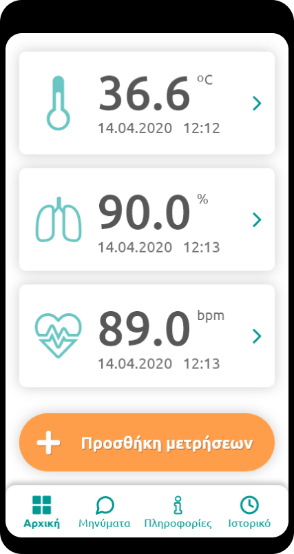
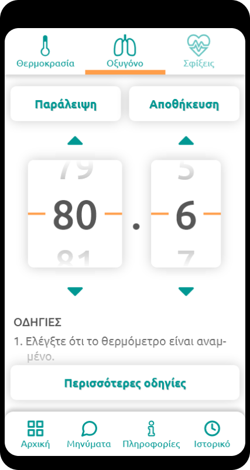
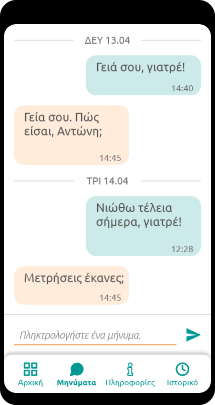

# @HOME: Παρακολούθηση της κατάστασης της υγείας ασθενών με COVID-19  για όσο καιρό «μένουνε σπίτι»

Στον τομέα της υγείας, οι σημερινές τεχνολογικές εξελίξεις, σε συνδυασμό με τη πρόοδο της Ιατρικής, προσφέρουν τη δυνατότητα βελτίωσης της ποιότητας ζωής των ανθρώπων, μέσω της υποστήριξης, της πρόληψης, της προτροπής υιοθέτησης υγιεινών συμπεριφορών και της θεραπείας και παρακολούθησης των χρόνιων παθήσεων, των έκτακτων περιστατικών, καθώς και των καταστάσεων συναγερμού για τη δημόσια υγεία, όπως της πανδημίας COVID-19. 

Τα τελευταία χρόνια, το [Πρόγραμμα Διάχυτης Νοημοσύνης (ΑΜΙ)](http://ami.ics.forth.gr) του Ινστιτούτου Πληροφορικής (ΙΠ) του ΙΤΕ, με τη συμμετοχή της Ιατρικής Σχολής του Πανεπιστημίου Κρήτης, έχει διεξάγει έρευνα που αποσκοπεί στην παροχή έξυπνων ολοκληρωμένων υποστηρικτικών περιβαλλόντων, για την κατ’ οίκον παρακολούθηση ασθενών μέσω σύγχρονων τεχνολογιών, με στόχο τη συντόμευση της παραμονής τους στο νοσοκομείο και τη διευκόλυνση της ασφαλούς καθημερινής ζωής τους. 

Με τη ραγδαία έξαρση της πανδημίας COVID-19, η συσσωρευμένη εμπειρία και γνώση του ΙΠ-ΙΤΕ στην ανάπτυξη τέτοιων τεχνολογιών έχει αξιοποιηθεί για την παροχή ενός αντίστοιχου περιβάλλοντος παρακολούθησης ατόμων που είναι θετικά στο κορωνοϊό αλλά δεν χρήζουν νοσοκομειακής περίθαλψης, ώστε να καταγράφονται και να αξιολογούνται με ασφάλεια οι εξελίξεις της υγείας τους και να μειώνεται ο κίνδυνος μετάδοσης του ιού από επισκέψεις των ατόμων αυτών στα νοσοκομεία ή από τις κατ’ οίκον επισκέψεις ιατρο-νοσηλευτικού προσωπικού όταν αυτές δεν είναι απαραίτητες. 

## Το σύστημα @HOME
Το σύστημα προσφέρει στους ασθενείς μια πολύ απλή εφαρμογή για έξυπνες συσκευές κινητών τηλεφώνων και στην ιατρική ομάδα παρακολούθησης μια εφαρμογή desktop. Όταν ένας ασθενής διαγνωστεί με COVID-19, εγγράφεται στο σύστημα και συμπληρώνει την ηλικία του και τυχόν προ-υπάρχουσες παθήσεις του που μπορούν να αποτελούν παράγοντες κινδύνου για την υγεία του. Μέσω της κινητής εφαρμογής, ο ασθενής λαμβάνει τέσσερεις φορές την ημέρα υπενθυμίσεις για τη μέτρηση της θερμοκρασίας του σώματός του (με θερμόμετρο), και του κορεσμού οξυγόνου του και των παλμών της καρδιάς του (με οξύμετρο). Στη συνέχεια, αφού προχωρήσει στις συγκεκριμένες μετρήσεις, τις καταχωρεί στην εφαρμογή με πολύ εύκολο και εύχρηστο τρόπο. Επίσης, μέσω της εφαρμογής, ο ασθενής μπορεί να επικοινωνεί με την ιατρική ομάδα παρακολούθησης μέσω απλών γραπτών μηνυμάτων, ενώ έχει επίσης άμεση πρόσβαση σε έγκυρη πληροφόρηση για τον COVID-19. Μέσω της καταγραφής των μετρήσεων και του υπολογισμού τυχόν αποκλίσεων από τα φυσιολογικά όρια, σε συνδυασμό με τον συνυπολογισμό των παραγόντων κινδύνου, η ιατρική ομάδα έχει συνεχή εικόνα της εξέλιξης της κατάστασης όλων των εγγεγραμμένων ασθενών και ανά πάσα στιγμή γνωρίζει αν υπάρχει κάποια επιδείνωση της κατάστασης ενός ασθενή που απαιτεί παρέμβαση, ώστε να επέμβει εγκαίρως. 

#### Στιγμιότυπα της εφαρμογής για κινητές συσκευές που χρησιμοποιούν οι ασθενείς που “μένουν σπίτι”

<table border="0">
  <tbody>
    <tr>
      <td></td><td>&nbsp;&nbsp;&nbsp;</td>
      <td></td><td>&nbsp;&nbsp;&nbsp;</td>
      <td></td><td>&nbsp;&nbsp;&nbsp;</td>
    </tr>
  </tbody>
</table>

#### Στιγμιότυπα της εφαρμογής desktop για το ιατρικό προσωπικό

<table border="0">
  <tbody>
    <tr>
      <td>
      </td><td>&nbsp;</td>
      <td></td>
    </tr>
  </tbody>
</table>

## Προσωπικά δεδομένα
Το σύστημα ‘@HOME’ που αφορά την παρακολούθηση ασθενών με COVID-19 τηρεί όλες τις απαιτήσεις για την προστασία της ιδιωτικότητας  των προσωπικών δεδομένων των ασθενών και στόχος είναι να δοκιμαστεί πιλοτικά τις επόμενες ημέρες σε νοσοκομεία, αρχικά της Ελλάδος και αργότερα του εξωτερικού. Είναι δωρεάν διαθέσιμο για αξιοποίηση από την Πολιτεία. 

## Πρόγραμμα Διάχυτης Νοημοσύνης του ΙΠ-ΙΤΕ
Στο [Ινστιτούτο Πληροφορικής του ΙΤΕ (ΙΠ-ΙΤΕ)](https://www.ics.forth.gr) λειτουργεί από τα μέσα της προηγούμενης δεκαετίας  το Πρόγραμμα Διάχυτης Νοημοσύνης (ΑΜΙ), το οποίο στοχεύει, μέσω διεπιστημονικής έρευνας, στην ανάπτυξη καινοτόμων ανθρωποκεντρικών τεχνολογιών αιχμής και στη μελέτη των επιπτώσεών τους, τόσο στο άτομο, όσο και στο κοινωνικό σύνολο. Το Πρόγραμμα ΑΜΙ βρίσκει εφαρμογή σε διάφορους τομείς της καθημερινής ζωής (υγεία, εκπαίδευση, εργασία, τέχνη και πολιτισμό, εμπόριο / μάρκετινγκ / διαφήμιση, κλπ), και στο πλαίσιο της λειτουργίας του έχουν σχεδιαστεί και αναπτυχθεί πληθώρα καινοτόμων συστημάτων, εφαρμογών και υπηρεσιών που υποστηρίζουν την αλληλεπίδραση ανθρώπων και τεχνολογικών συστημάτων με απλό, φυσικό και ιδιαίτερα  φιλικό τρόπο. 

Το σύστημα @HOME αναπτύχθηκε στο πλαίσιο του διεπιστημονικού [Προγράμματος Διάχυτης Νοημοσύνης (ΑΜΙ)](http://ami.ics.forth.gr) του ΙΠ-ΙΤΕ, υπό την επίβλεψη του Καθηγητή Κωνσταντίνου Στεφανίδη, Επικεφαλής του Προγράμματος ΑΜΙ και του HCI Lab, και την ιατρική εποπτεία και επιμέλεια του συνεργαζόμενου με το Πρόγραμμα ΑΜΙ Αναπληρωτή Καθηγητή Γεωργίου Νότα της Ιατρικής Σχολής του Πανεπιστημίου Κρήτης. 

Για τη σχεδίαση και ανάπτυξη της εφαρμογής απασχολήθηκαν τα ακόλουθα μέλη του ερευνητικού και τεχνικού προσωπικού του ΙΠ-ΙΤΕ:  - Μαργκερίτα Αντόνα
- Γεώργιος Μαθιουδάκης
- Νίκος Ανυφαντής
- Γεώργιος Μεταξάκης
- Μιχάλης Φουκαράκης
- Ιωάννα Ζηδιανάκη 
- Νατάσα Νταγιαντά
- Ιωσήφ Κληρονόμος
- Γεώργιος Μαργέτης.

