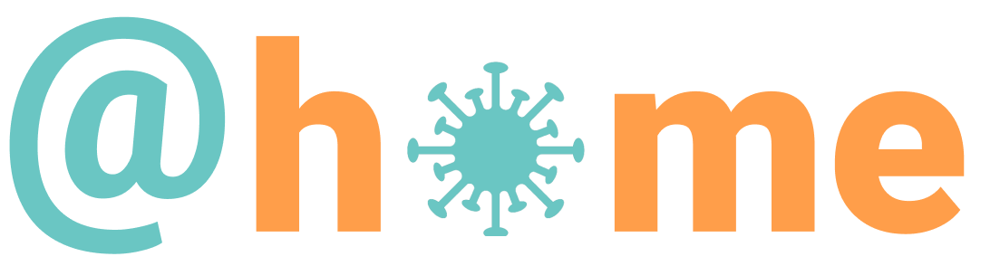
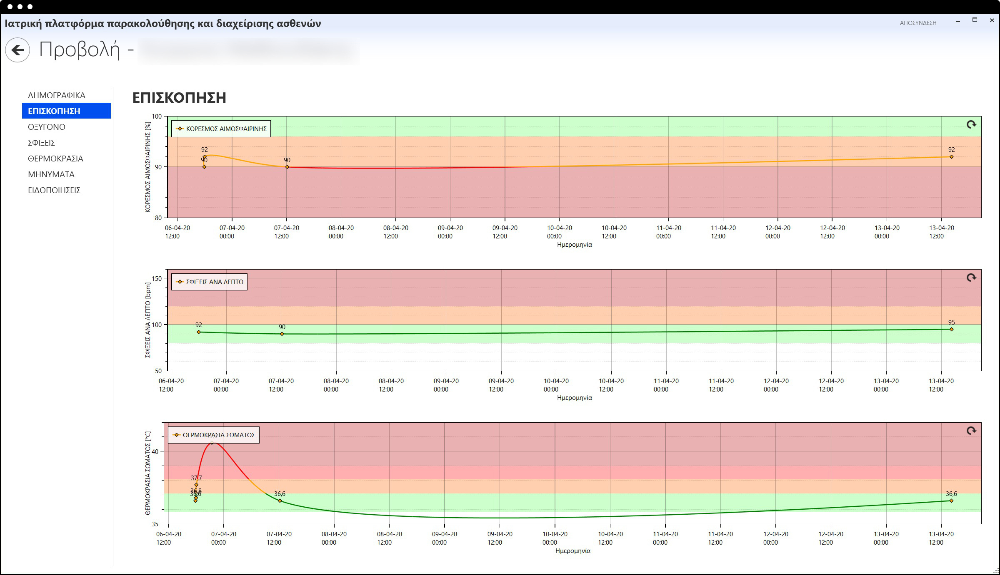
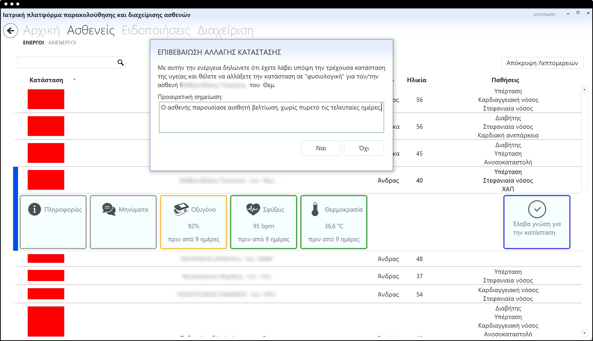

  <strong>
    <a href="./Readme.md">Ελληνικά</a>
  </strong>

 &nbsp;
# Monitoring of COVID-19 patients’ health condition 
Today’s technological advances, coupled with progress in the medical field, have the potential to contribute for improving people’s quality of life though the provision of systems which foster disease prevention, encourage healthy life style, support therapies, provide means to monitor chronic conditions, respond to emergency situations, as well as prevent risks for public health, such as the current COVID-19 pandemic.

In recent years, the Institute of Computer Science (ICS) of the Foundation for Research and Technology-Hellas (FORTH), in the context of its Ambient Intelligence Programme, and in collaboration with the School of Medicine of the University of Crete, has conducted research targeted to the development of integrated assistive environments for patient monitoring through the use of advanced technologies. The main objectives are to reduce the duration of hospitalization and to enhance safety in everyday life.

Based on the knowledge and experience acquired in the above efforts and in order to contribute towards containing the current worldwide pandemic, ICS-FORTH has developed a system for remotely monitoring COVID-19 patients who do not require hospitalization. The idea is to provide means for safely, effectively and efficiently following the evolution of patients’ health situation without requiring unnecessary hospital or home visits which would increase the risk of virus transmission.

## The @HOME system
@HOME offers to patients a very simple and friendly smartphone application and to medical teams a desktop application. When a person is diagnosed as positive to COVID-19, (s)he is registered into the system and information about age and pre-existing conditions which may constitute risk her/his profile. Through the @HOME mobile application, the patient receives four times a day reminders regarding the measurement of body temperature (using a thermometer), oxygen saturation and heart rate (using pulse oximeter). The measurements are subsequently recorded in the app in an easy and user-friendly way. Through the app the patient can also exchange messages with the medical team and access official information about COVID-19. The recorded measurements are used to identify potential deviations from set thresholds. Based on such data, and taking into account potential risk factors, the medical team can monitor at any time the evolution of the health situation of all registered patients and can be alerted to react promptly, when an emerging condition requires intervention.

#### Screenshots of the mobile application for patients at home

<table border="0">
  <tbody>
    <tr>
      <td></td><td>&nbsp;&nbsp;&nbsp;&nbsp;&nbsp;&nbsp;</td>
      <td></td><td>&nbsp;&nbsp;&nbsp;&nbsp;&nbsp;&nbsp;</td>
      <td></td><td>&nbsp;&nbsp;&nbsp;&nbsp;&nbsp;&nbsp;</td>
    </tr>
  </tbody>
</table>

#### Screenshots of the desktop application for the medical team

<table border="0">
  <tbody>
    <tr>
      <td>
      </td><td>&nbsp;</td>
      <td></td>
    </tr>
  </tbody>
</table>

## Personal data
The @HOME system complies with all requirements for the privacy protection of patients’ personal data. Following a trial period initially in Greece and later on abroad, it will be made available to download at no cost.

## ICS-FORTH Ambient Intelligence Programme
The [Ambient Intelligence (AmI) Programme](http://ami.ics.forth.gr/) of [ICS-FORTH](https://www.ics.forth.gr), active since 2005, is a long-term horizontal interdisciplinary RTD Programme aiming to develop and deploy pioneering human-centric AmI technologies in Smart Environments. The Programme constitutes a platform for cooperative research towards developing and studying AmI-related technologies and assessing their impact upon the individual, as well as upon the society as a whole, but also as a unique showcase for demonstrating the potential, added-value and benefits of AmI technologies in different aspects of everyday life and activities. Research and development work follows a human-centred approach, and addresses various everyday living environments and activities, including, but not limited to health, education, workplace, art and culture, commerce, marketing and advertising. The Programme has developed a wide variety of systems, applications and services which support human interaction with technological environments in a simple, natural and user-friendly way. 
The @HOME system has been developed in the context of the AmI Programme under the supervision of Professor Constantine Stephanidis, Head of the Ambient Intelligence Programme and of the Human Computer Interaction Laboratory of ICS-FORTH, in cooperation with Dr. Georgios Notas, Associate Professor at the School of Medicine of the University of Crete and collaborating researcher of the AmI Programme.

The following personnel of ICS-FORTH has collaborated the development: 
- Margherita Antona 
- Georgios Mathioudakis
- Nikos Anyfantis
- Georgios Metaxakis
- Michalis Foukarakis
- Ioanna Zidianaki
- Natasa Ntagianta
- Iosif Klironomos
- Georgios Margetis
- Goergios Notas
- Constantine Stephanidis
